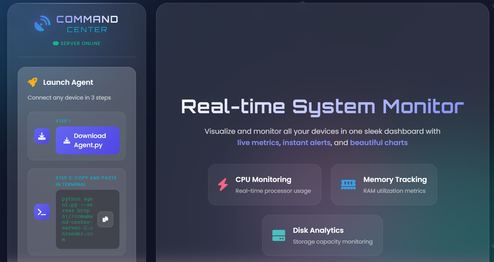
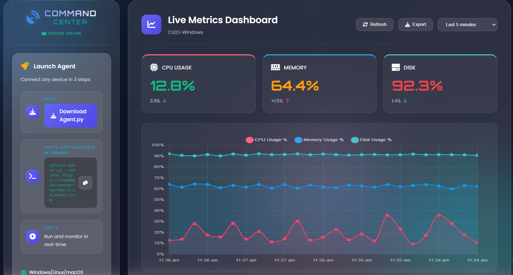

# 🚀 Command Center – Real-Time System Monitoring Dashboard

A modern real-time monitoring platform that tracks CPU, Memory, and Disk usage across multiple devices using lightweight agents.

The system provides live visualization, historical analytics, health alerts, and a beautiful interactive dashboard.

---

## 🌐 Live Demo

Check out the live application: [**Command Center Demo**](https://comamand-center-server-2.onrender.com)

> ⚡ *Experience the real-time monitoring dashboard in action!*

---

## ✨ Features

- 📡 Real-time device monitoring  
- 📊 Live CPU / Memory / Disk charts  
- 🧠 Smart health detection (Good / Warning / Critical)  
- 🔔 Intelligent alert system with cooldown (no spam)  
- 🖥️ Multiple device support  
- 📁 Historical metrics tracking  
- ⬇️ Export chart as image  
- 🎯 Clean glassmorphism UI  
- ⚡ Smooth animated updates  

---

## 🧩 Architecture
Agent (Python) → Flask API Server → Web Dashboard (Chart.js)

text

Each device runs a small agent that periodically sends system metrics to the server.

---

## 🛠️ Tech Stack


**Backend**
- Flask
- SQLAlchemy
- SQLite

**Frontend**
- HTML / CSS
- JavaScript
- Chart.js
- Font Awesome

---

## 📦 Setup Instructions

### Clone the repository
```bash
git clone https://github.com/neutromax/comamand-center-server-.git

cd comamand-center-server-/server
```
---

### Install dependencies
```bash
pip install -r requirements.txt
```
---

### Start the server
```bash
python app.py
```
---
### The dashboard will be available at 
```bash
http://127.0.0.1:5000
```


---

## Running the Monitoring Agent

Download agent.py from the dashboard or repository and run:
```bash
python agent.py --server http://127.0.0.1:5000
```
#### Once connected, the device will automatically appear in the dashboard.

---

## 🚨 Alert System
Notifications are triggered when:

Usage > 60% → Warning

Usage > 80% → Critical

To prevent spam, alerts are rate-limited (example: once every 5 minutes per metric).

---

## 📊 Dashboard Capabilities
Device health prioritization

Auto-refresh metrics

Historical trend visualization

Live data feed

One-click refresh

---

## 📁 Project Structure
```bash
server/
│── app.py
│── models.py
│── requirements.txt
│
├── templates/
│   └── index.html
│
└── static/
    ├── css/
    └── js/
        ├── app.js
        └── utils.js
```

---
## 📸 Screenshots

### Home Page


### Dashboard


---

## 🌍 Deployment
The project can be deployed easily on platforms like:

Render

Railway

VPS / Cloud VM

---

## 🎯 Use Cases
Remote system monitoring

Lab infrastructure

DevOps dashboards

Personal server tracking

Network device supervision

---

## 🔮 Future Improvements
Authentication system

Per-device alert settings

Email / Slack notifications

Role-based access

Advanced analytics

---
## 👨‍💻 Author

Developed by **Bhavith**.

- GitHub: [@neutromax](https://github.com/neutromax)
- Project Link: [https://github.com/neutromax/comamand-center-server-](https://github.com/neutromax/comamand-center-server-)
- Live Demo: [https://comamand-center-server-2.onrender.com](https://comamand-center-server-2.onrender.com)

---

## 📜 License
This project is for educational and portfolio purposes.


